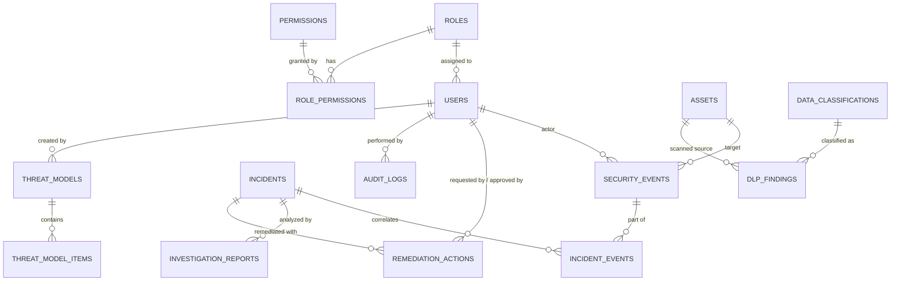

# SentinelForge Database Design & Schema Specification

## 1. Overview & Data Integrity Principles

The SentinelForge persistence layer is engineered with **PostgreSQL 16**, leveraging strict relational constraints, referential integrity, foreign key cascades/protects, unique constraints, and B-Tree indexes for fast security event querying and timeline construction.

### Data Security Constraints
- **Zero Plaintext Secrets**: Passwords are saved as Argon2id/Bcrypt hashes. Secret detections are stored in masked format (`AKIA****************MPLE`).
- **Append-Only Auditability**: Audit logs are structurally immutable. No `UPDATE` or `DELETE` triggers are exposed to standard application flows.
- **Explainable Scoring Persistence**: Incident records persist individual risk scoring breakdown components.

---

## 2. Entity-Relationship Overview

---

## 3. Normalized Database Schema Specifications

### 3.1 Identity & Access Management (RBAC)

#### `roles`
| Column | Type | Constraints | Description |
| :--- | :--- | :--- | :--- |
| `id` | UUID | PRIMARY KEY, DEFAULT gen_random_uuid() | Unique role identifier |
| `name` | VARCHAR(50) | UNIQUE, NOT NULL | Role name (`Admin`, `Analyst`, `Developer`, `Viewer`) |
| `description` | TEXT | NULLABLE | Detailed responsibility scope |
| `created_at` | TIMESTAMPTZ | NOT NULL, DEFAULT now() | Creation timestamp |

#### `permissions`
| Column | Type | Constraints | Description |
| :--- | :--- | :--- | :--- |
| `id` | UUID | PRIMARY KEY, DEFAULT gen_random_uuid() | Unique permission identifier |
| `name` | VARCHAR(100) | UNIQUE, NOT NULL | Permission slug (e.g. `policy:write`, `incident:investigate`) |
| `description` | TEXT | NULLABLE | Explanation of authorization boundary |

#### `role_permissions`
| Column | Type | Constraints | Description |
| :--- | :--- | :--- | :--- |
| `role_id` | UUID | REFERENCES roles(id) ON DELETE CASCADE | Target role |
| `permission_id` | UUID | REFERENCES permissions(id) ON DELETE CASCADE | Associated permission |
| *Composite PK* | (role_id, permission_id) | | Enforces uniqueness |

#### `users`
| Column | Type | Constraints | Description |
| :--- | :--- | :--- | :--- |
| `id` | UUID | PRIMARY KEY, DEFAULT gen_random_uuid() | Unique user identifier |
| `email` | VARCHAR(255) | UNIQUE, NOT NULL, INDEXED | Email address (login principal) |
| `password_hash` | VARCHAR(255) | NOT NULL | Bcrypt/Argon2 hash (never plaintext) |
| `name` | VARCHAR(100) | NOT NULL | Full user name |
| `role_id` | UUID | NOT NULL, REFERENCES roles(id) | Assigned authorization role |
| `is_active` | BOOLEAN | NOT NULL, DEFAULT true | Account active flag |
| `failed_login_attempts`| INT | NOT NULL, DEFAULT 0 | Counter for progressive throttling |
| `locked_until` | TIMESTAMPTZ | NULLABLE | Account lockout expiration |
| `created_at` | TIMESTAMPTZ | NOT NULL, DEFAULT now() | Record creation timestamp |
| `updated_at` | TIMESTAMPTZ | NOT NULL, DEFAULT now() | Record modification timestamp |
| `last_login_at` | TIMESTAMPTZ | NULLABLE | Last successful authentication |

---

### 3.2 Assets & Data Classifications

#### `data_classifications`
| Column | Type | Constraints | Description |
| :--- | :--- | :--- | :--- |
| `id` | UUID | PRIMARY KEY, DEFAULT gen_random_uuid() | Classification UUID |
| `name` | VARCHAR(50) | UNIQUE, NOT NULL | Level (`PUBLIC`, `INTERNAL`, `CONFIDENTIAL`, `RESTRICTED`) |
| `description` | TEXT | NOT NULL | Definition and handling requirements |
| `severity_weight`| INT | NOT NULL, DEFAULT 0 | Weight added to risk score calculation |

#### `assets`
| Column | Type | Constraints | Description |
| :--- | :--- | :--- | :--- |
| `id` | UUID | PRIMARY KEY, DEFAULT gen_random_uuid() | Asset identifier |
| `name` | VARCHAR(150) | NOT NULL, INDEXED | Asset resource name (e.g., `prod-db-cluster`, `s3-customer-bucket`) |
| `type` | VARCHAR(50) | NOT NULL | Asset type (`DATABASE`, `BUCKET`, `API`, `SERVER`, `REPOSITORY`) |
| `environment` | VARCHAR(50) | NOT NULL, DEFAULT 'production' | Scope (`production`, `staging`, `development`) |
| `owner` | VARCHAR(100) | NOT NULL | Owning team or individual |
| `classification_id`| UUID | REFERENCES data_classifications(id) | Associated classification sensitivity |
| `asset_metadata` | JSONB | NOT NULL, DEFAULT '{}'::jsonb | Key-value tags, IP CIDRs, cloud ARN |
| `created_at` | TIMESTAMPTZ | NOT NULL, DEFAULT now() | Record creation |

---

### 3.3 Security Events & Correlation

#### `security_events`
| Column | Type | Constraints | Description |
| :--- | :--- | :--- | :--- |
| `id` | UUID | PRIMARY KEY, DEFAULT gen_random_uuid() | Event ID |
| `event_type` | VARCHAR(80) | NOT NULL, INDEXED | Normalized event type (e.g., `failed_login`, `dlp_violation`) |
| `severity` | VARCHAR(20) | NOT NULL, INDEXED | Normalized severity (`INFO`, `LOW`, `MEDIUM`, `HIGH`, `CRITICAL`) |
| `source` | VARCHAR(80) | NOT NULL, INDEXED | Source identifier (`auth_service`, `gateway`, `dlp_scanner`) |
| `user_id` | UUID | NULLABLE, REFERENCES users(id) ON DELETE SET NULL | Involved user identity if known |
| `actor` | VARCHAR(120) | NOT NULL, INDEXED | Actor principal string / username / service name |
| `asset_id` | UUID | NULLABLE, REFERENCES assets(id) ON DELETE SET NULL | Targeted resource asset |
| `source_ip` | VARCHAR(45) | NOT NULL, INDEXED | Originating IPv4 or IPv6 address |
| `timestamp` | TIMESTAMPTZ | NOT NULL, INDEXED | Event generation timestamp |
| `raw_payload` | JSONB | NOT NULL | Untampered incoming event payload |
| `normalized_payload`| JSONB | NOT NULL | Normalized attributes |
| `created_at` | TIMESTAMPTZ | NOT NULL, DEFAULT now() | Database arrival timestamp |

#### `incidents`
| Column | Type | Constraints | Description |
| :--- | :--- | :--- | :--- |
| `id` | UUID | PRIMARY KEY, DEFAULT gen_random_uuid() | Incident identifier |
| `incident_number`| VARCHAR(20) | UNIQUE, NOT NULL, INDEXED | Human-readable tag (e.g., `INC-1042`) |
| `title` | VARCHAR(255) | NOT NULL | Descriptive incident title |
| `description` | TEXT | NOT NULL | High-level summary of correlated activity |
| `severity` | VARCHAR(20) | NOT NULL, INDEXED | `LOW`, `MEDIUM`, `HIGH`, `CRITICAL` |
| `status` | VARCHAR(30) | NOT NULL, DEFAULT 'OPEN', INDEXED| `OPEN`, `INVESTIGATING`, `CONTAINED`, `RESOLVED`, `CLOSED` |
| `risk_score` | INT | NOT NULL, DEFAULT 0 | Computed risk score (0-100) |
| `risk_factors` | JSONB | NOT NULL, DEFAULT '[]'::jsonb | Detailed scoring explanation items |
| `confidence` | NUMERIC(4,3)| NOT NULL, DEFAULT 1.000 | Detection confidence (0.000 - 1.000) |
| `assigned_to` | UUID | NULLABLE, REFERENCES users(id) ON DELETE SET NULL | Assigned security analyst |
| `detected_at` | TIMESTAMPTZ | NOT NULL, DEFAULT now() | Detection trigger timestamp |
| `resolved_at` | TIMESTAMPTZ | NULLABLE | Incident resolution timestamp |
| `created_at` | TIMESTAMPTZ | NOT NULL, DEFAULT now() | Record creation |
| `updated_at` | TIMESTAMPTZ | NOT NULL, DEFAULT now() | Record update |

#### `incident_events`
| Column | Type | Constraints | Description |
| :--- | :--- | :--- | :--- |
| `incident_id` | UUID | REFERENCES incidents(id) ON DELETE CASCADE | Associated incident |
| `event_id` | UUID | REFERENCES security_events(id) ON DELETE CASCADE | Associated security event |
| *Composite PK* | (incident_id, event_id) | | Enforces unique link |

---

### 3.4 DLP & Secret Scanning

#### `dlp_findings`
| Column | Type | Constraints | Description |
| :--- | :--- | :--- | :--- |
| `id` | UUID | PRIMARY KEY, DEFAULT gen_random_uuid() | Finding identifier |
| `source_type` | VARCHAR(50) | NOT NULL | Source kind (`PAYLOAD`, `FILE_UPLOAD`, `GIT_COMMIT`, `API_BODY`) |
| `source_id` | VARCHAR(120) | NOT NULL | Specific identifier of source object |
| `data_type` | VARCHAR(60) | NOT NULL, INDEXED | Detected token type (e.g. `AWS_ACCESS_KEY`, `EMAIL_PII`, `JWT`) |
| `classification`| VARCHAR(30) | NOT NULL | Sensitivity (`INTERNAL`, `CONFIDENTIAL`, `RESTRICTED`) |
| `matched_pattern`| VARCHAR(255)| NOT NULL | Masked sample representation (e.g. `AKIA****************MPLE`) |
| `confidence` | NUMERIC(4,3)| NOT NULL | Deterministic confidence score |
| `action` | VARCHAR(30) | NOT NULL | Policy decision (`ALLOW`, `WARN`, `BLOCK`, `QUARANTINE`) |
| `created_at` | TIMESTAMPTZ | NOT NULL, DEFAULT now() | Detection timestamp |

---

### 3.5 AI Investigation & Human-in-the-Loop Remediation

#### `investigation_reports`
| Column | Type | Constraints | Description |
| :--- | :--- | :--- | :--- |
| `id` | UUID | PRIMARY KEY, DEFAULT gen_random_uuid() | Investigation record ID |
| `incident_id` | UUID | NOT NULL, REFERENCES incidents(id) ON DELETE CASCADE | Target incident |
| `summary` | TEXT | NOT NULL | Executive concise summary |
| `attack_chain` | JSONB | NOT NULL, DEFAULT '[]'::jsonb | Sequenced attack steps |
| `evidence` | JSONB | NOT NULL, DEFAULT '[]'::jsonb | Verified event references and facts |
| `findings` | JSONB | NOT NULL, DEFAULT '[]'::jsonb | Key security findings |
| `recommendations`| JSONB | NOT NULL, DEFAULT '[]'::jsonb | Suggested mitigations |
| `confidence` | NUMERIC(4,3)| NOT NULL | Agent certainty score |
| `model_used` | VARCHAR(80) | NOT NULL | LLM model identifier |
| `created_by` | UUID | NULLABLE, REFERENCES users(id) | Investigator trigger user |
| `created_at` | TIMESTAMPTZ | NOT NULL, DEFAULT now() | Generation timestamp |

#### `remediation_actions`
| Column | Type | Constraints | Description |
| :--- | :--- | :--- | :--- |
| `id` | UUID | PRIMARY KEY, DEFAULT gen_random_uuid() | Action ID |
| `incident_id` | UUID | NOT NULL, REFERENCES incidents(id) ON DELETE CASCADE | Associated incident |
| `action_type` | VARCHAR(80) | NOT NULL | Remediation category (`DISABLE_USER`, `REVOKE_TOKEN`, `QUARANTINE_ASSET`) |
| `description` | TEXT | NOT NULL | Context and target of action |
| `status` | VARCHAR(30) | NOT NULL, DEFAULT 'PENDING_APPROVAL' | `PENDING_APPROVAL`, `APPROVED`, `REJECTED`, `EXECUTED`, `FAILED` |
| `requested_by` | UUID | NULLABLE, REFERENCES users(id) | Initiator (Analyst or AI Agent) |
| `approved_by` | UUID | NULLABLE, REFERENCES users(id) | Approving Admin user (Mandatory for execution) |
| `rejection_reason`| TEXT | NULLABLE | Justification if rejected |
| `execution_result`| JSONB | NULLABLE | Execution telemetry / simulation response |
| `executed_at` | TIMESTAMPTZ | NULLABLE | Timestamp of execution |
| `created_at` | TIMESTAMPTZ | NOT NULL, DEFAULT now() | Request timestamp |

---

### 3.6 Threat Modeling & Application Security

#### `threat_models`
| Column | Type | Constraints | Description |
| :--- | :--- | :--- | :--- |
| `id` | UUID | PRIMARY KEY, DEFAULT gen_random_uuid() | Model ID |
| `name` | VARCHAR(150) | NOT NULL | Threat model title |
| `architecture_summary`| TEXT | NOT NULL | Architectural components and boundaries |
| `created_by` | UUID | NOT NULL, REFERENCES users(id) | Author |
| `created_at` | TIMESTAMPTZ | NOT NULL, DEFAULT now() | Creation timestamp |

#### `threat_model_items`
| Column | Type | Constraints | Description |
| :--- | :--- | :--- | :--- |
| `id` | UUID | PRIMARY KEY, DEFAULT gen_random_uuid() | Threat item ID |
| `threat_model_id`| UUID | NOT NULL, REFERENCES threat_models(id) ON DELETE CASCADE | Parent threat model |
| `stride_category`| VARCHAR(40) | NOT NULL | `SPOOFING`, `TAMPERING`, `REPUDIATION`, `INFO_DISCLOSURE`, `DOS`, `ELEVATION` |
| `target_component`| VARCHAR(100)| NOT NULL | Component under threat |
| `description` | TEXT | NOT NULL | Threat scenario details |
| `mitigation` | TEXT | NOT NULL | Concrete mitigation strategy |
| `status` | VARCHAR(30) | NOT NULL, DEFAULT 'OPEN' | `OPEN`, `MITIGATED`, `ACCEPTED`, `FALSE_POSITIVE` |

#### `scan_findings`
| Column | Type | Constraints | Description |
| :--- | :--- | :--- | :--- |
| `id` | UUID | PRIMARY KEY, DEFAULT gen_random_uuid() | Finding UUID |
| `scanner` | VARCHAR(50) | NOT NULL | Scanner tool (`bandit`, `pip-audit`, `semgrep`, `trivy`) |
| `rule_id` | VARCHAR(100) | NOT NULL | Specific scanner rule identifier |
| `severity` | VARCHAR(20) | NOT NULL | `INFO`, `LOW`, `MEDIUM`, `HIGH`, `CRITICAL` |
| `file_path` | VARCHAR(255) | NOT NULL | Target file location |
| `line_number` | INT | NULLABLE | Line number |
| `description` | TEXT | NOT NULL | Vulnerability description |
| `remediation` | TEXT | NOT NULL | Recommended fix |
| `status` | VARCHAR(30) | NOT NULL, DEFAULT 'OPEN' | `OPEN`, `RESOLVED`, `IGNORED` |
| `created_at` | TIMESTAMPTZ | NOT NULL, DEFAULT now() | Scan execution time |

---

### 3.7 Governance, Policies, & Audit Trails

#### `security_policies`
| Column | Type | Constraints | Description |
| :--- | :--- | :--- | :--- |
| `id` | UUID | PRIMARY KEY, DEFAULT gen_random_uuid() | Policy UUID |
| `name` | VARCHAR(120) | NOT NULL, UNIQUE | Human policy name |
| `description` | TEXT | NOT NULL | Operational intent |
| `policy_type` | VARCHAR(50) | NOT NULL | `DLP`, `RATE_LIMIT`, `ACCESS_CONTROL`, `ALERTING` |
| `configuration`| JSONB | NOT NULL | Rule parameters (thresholds, regex, actions) |
| `enabled` | BOOLEAN | NOT NULL, DEFAULT true | Active flag |
| `created_by` | UUID | NULLABLE, REFERENCES users(id) | Authoring admin |
| `created_at` | TIMESTAMPTZ | NOT NULL, DEFAULT now() | Creation timestamp |

#### `audit_logs` (Append-Only)
| Column | Type | Constraints | Description |
| :--- | :--- | :--- | :--- |
| `id` | UUID | PRIMARY KEY, DEFAULT gen_random_uuid() | Log event ID |
| `actor_id` | UUID | NULLABLE, REFERENCES users(id) | User who executed the action |
| `actor_email` | VARCHAR(255) | NOT NULL | Actor email snapshot at event time |
| `action` | VARCHAR(80) | NOT NULL, INDEXED | Event action slug (`USER_LOGIN`, `REMEDIATION_APPROVED`, etc.) |
| `resource_type`| VARCHAR(60) | NOT NULL, INDEXED | Target type (`INCIDENT`, `USER`, `POLICY`, `REMEDIATION`) |
| `resource_id` | VARCHAR(100) | NOT NULL, INDEXED | Target UUID or identifier |
| `result` | VARCHAR(20) | NOT NULL | `SUCCESS`, `FAILURE`, `DENIED` |
| `metadata` | JSONB | NOT NULL, DEFAULT '{}'::jsonb | Request ID, IP address, parameters (NO SECRETS) |
| `timestamp` | TIMESTAMPTZ | NOT NULL, DEFAULT now(), INDEXED | Strict chronologic timestamp |
