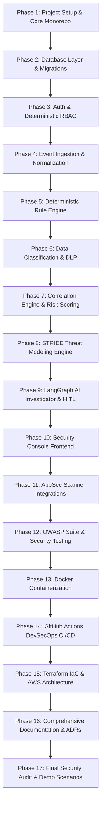

# SentinelForge Implementation Roadmap

This document outlines the phased, verified engineering plan for SentinelForge. In accordance with the project specification:
1. Each phase is implemented incrementally.
2. After each phase, tests are executed and verified.
3. Failures are diagnosed and resolved before proceeding to subsequent phases.
4. Security foundation is prioritized before AI/LLM orchestration.

---

## Phase Overview

---

## Detailed Phase Breakdown

### Phase 1: Repository Setup & Foundation
- **Goal**: Initialize clean monorepo structure (`frontend/`, `backend/`, `docs/`, `infra/`, `.github/`).
- **Deliverables**:
  - Python virtual environment & `backend/pyproject.toml` or `requirements.txt`.
  - Core FastAPI application skeleton with health check endpoints (`/health`, `/ready`).
  - Configuration management using Pydantic Settings (`.env` validation).
  - Centralized structured logging and exception handling.

### Phase 2: Database Layer & Models
- **Goal**: Implement normalized PostgreSQL database models using SQLAlchemy 2.0 (asyncpg).
- **Deliverables**:
  - Entity models: `User`, `Role`, `Permission`, `RolePermission`, `SecurityEvent`, `Incident`, `IncidentEvent`, `Asset`, `DataClassification`, `DlpFinding`, `SecurityPolicy`, `AuditLog`, `InvestigationReport`, `RemediationAction`, `ThreatModel`, `ThreatModelItem`, `ScanFinding`.
  - Database connection pool manager and session lifecycle.
  - Development seed script populating default roles, permissions, data classifications, and synthetic demo users (`admin`, `analyst`, `developer`, `viewer`).

### Phase 3: Authentication & Deterministic RBAC
- **Goal**: Secure authentication and server-side role-based access control.
- **Deliverables**:
  - Password hashing with Bcrypt/Argon2.
  - JWT generation, validation, and token refresh mechanism.
  - Progressive rate-limiting and account lockout logic.
  - FastAPI authorization dependencies (`require_auth`, `require_role`, `require_permission`).
  - Strict security tests verifying unauthorized users receive 401/403.

### Phase 4: Security Event Ingestion & Normalization
- **Goal**: High-throughput validated event ingestion API.
- **Deliverables**:
  - `POST /api/v1/events` endpoint accepting diverse event types.
  - Normalization engine mapping varied payload keys to uniform canonical attributes (`actor`, `source_ip`, `event_type`, `severity`, `timestamp`).
  - Schema validation with Pydantic; sanitization of incoming inputs.

### Phase 5: Deterministic Rule Engine
- **Goal**: Real-time rule evaluation without probabilistic unpredictability.
- **Deliverables**:
  - Rule definitions for Brute Force, Privilege Escalation, Suspicious Data Access, Credential Exposure, and Rate Anomalies.
  - Rule execution engine with sliding window state evaluation.
  - Triggering of security alerts upon rule match.

### Phase 6: Data Classification & DLP Engine
- **Goal**: High-fidelity detection of secrets and sensitive data with automated masking.
- **Deliverables**:
  - Regex and Shannon entropy heuristics for AWS keys, GitHub tokens, Slack webhooks, JWTs, database connection URIs, emails, phone numbers.
  - Masking engine (`AKIA****************MPLE`) guaranteeing zero plaintext secret storage.
  - DLP policy evaluator (`ALLOW`, `WARN`, `BLOCK`, `QUARANTINE_REVIEW`).

### Phase 7: Incident Correlation & Risk Scoring
- **Goal**: Correlation of isolated security events into comprehensive incidents with explainable risk scoring.
- **Deliverables**:
  - Graph/Entity correlation engine clustering events by actor, IP, asset, and temporal window.
  - Explainable Risk Score calculation engine (0–100 scale) with explicit factor breakdowns.
  - Dynamic Incident Timeline and attack graph node/edge generator.

### Phase 8: STRIDE Threat Modeling Engine
- **Goal**: Architecture threat modeling and risk tracking.
- **Deliverables**:
  - Threat model builder supporting component definitions and trust boundaries.
  - STRIDE classifier and mitigation recommendation mapping.
  - Lifecycle tracking (`OPEN`, `MITIGATED`, `ACCEPTED`, `FALSE_POSITIVE`).

### Phase 9: LangGraph AI Security Investigator & Human-in-the-Loop
- **Goal**: State-machine AI agent with strict read-only tool boundaries and human approval gates.
- **Deliverables**:
  - LangGraph workflow: `START -> LoadIncident -> CollectEvidence -> AnalyzeEvents -> CheckUserActivity -> CheckPermissions -> RetrievePolicy -> CorrelateAttackChain -> GenerateFindings -> RecommendRemediation -> HumanReviewGate -> END`.
  - Read-only tools (`search_security_events`, `get_incident`, `get_user_activity`, `get_dlp_findings`, `search_policies`).
  - RAG vector knowledge base with authorization-aware document retrieval.
  - Prompt injection defensive envelope separating system instructions, untrusted retrieved documents, and tool outputs.
  - Pydantic structured output validation with deterministic fallback mode.
  - Remediation approval API (`POST /api/v1/remediations/{id}/approve` and `reject`) strictly gated to `Admin`.

### Phase 10: Enterprise Security Console Frontend
- **Goal**: High-density, professional React operations dashboard.
- **Deliverables**:
  - Modern TypeScript + Vite + Tailwind CSS console.
  - Views: Login, Security Posture Dashboard, Incidents Table, Incident Detail (Timeline, Attack Graph, Evidence, AI Investigation, Remediation), DLP Findings, Threat Modeling, Application Scans, Policy Management, User Management, and Immutable Audit Logs.
  - Dark mode enterprise styling with high readability and zero gimmicks.

### Phase 11: Application Security Scanner Integrations
- **Goal**: Automated vulnerability ingestion and normalization.
- **Deliverables**:
  - Ingestion and reporting pipelines for SAST (Bandit/Semgrep), dependency scanning (Pip-audit/Safety), and secret scanning (TruffleHog/GitLeaks format).
  - Normalized scan findings repository and dashboard views.

### Phase 12: OWASP Testing Suite & Verification
- **Goal**: Deliberate regression test suite against OWASP Top 10 vulnerabilities.
- **Deliverables**:
  - Automated tests for Broken Access Control, Injection, Broken Authentication, IDOR, Malformed JWTs, Prompt Injection resistance, and Secret Masking.
  - Detailed vulnerability test report.

### Phase 13: Docker Containerization
- **Goal**: Production-ready, non-root, multi-stage container deployment.
- **Deliverables**:
  - Multi-stage Dockerfile for backend (Python 3.12-slim, non-root user `sentinel`).
  - Multi-stage Dockerfile for frontend (Node build -> NGINX alpine runtime).
  - `docker-compose.yml` linking FastAPI, React, PostgreSQL 16, and Redis 7.

### Phase 14: DevSecOps CI/CD Pipeline
- **Goal**: Automated security-first delivery pipeline in GitHub Actions.
- **Deliverables**:
  - `.github/workflows/ci.yml`: Linting, unit tests, integration tests.
  - `.github/workflows/security.yml`: SAST, dependency auditing, secret scanning, Docker image linting.
  - `.github/workflows/deploy.yml`: Staged container build and deployment verification.

### Phase 15: Terraform IaC & Cloud Architecture
- **Goal**: Modular, production-ready Infrastructure as Code for AWS.
- **Deliverables**:
  - Terraform modules: Networking (VPC, private subnets), Compute (ECS/ALB), Database (RDS PostgreSQL), Cache (ElastiCache Redis), Storage (S3 with Block Public Access), IAM (least-privilege roles), and CloudWatch Monitoring.
  - Environments configuration (`dev`, `staging`, `prod`).

### Phase 16: Documentation & ADRs
- **Goal**: Comprehensive technical documentation suite.
- **Deliverables**:
  - ADRs (PostgreSQL, FastAPI, LangGraph, Redis, RBAC, HITL remediation, AWS deployment).
  - Detailed guides: `security.md`, `ai-security.md`, `api.md`, `devsecops.md`, `deployment.md`, `incident-response.md`.

### Phase 17: Final Security Audit & Demo Scenarios
- **Goal**: End-to-end verification and technical interview readiness.
- **Deliverables**:
  - `docs/final-security-review.md`.
  - 5 executable demo scenarios (Credential Compromise, Committed Secret DLP, Broken Access Control block, Prompt Injection defense, and HITL remediation approval).
  - Interview talking points and architectural justification document.
